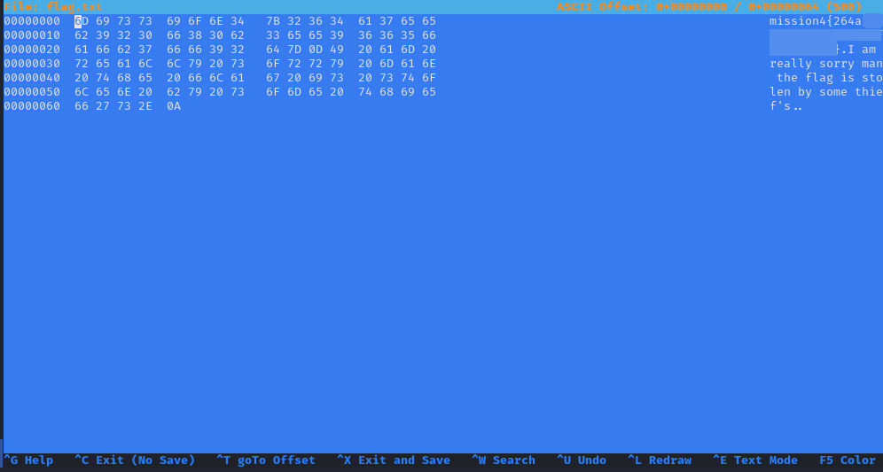

# Linux-Agency

## Linux Agency

***

## Info

| Name         | Linux Agency                                                                      |
| ------------ | --------------------------------------------------------------------------------- |
| Room link    | https://tryhackme.com/room/linuxagency                                            |
| Difficulty   | Medium                                                                            |
| Created by   | [Xyan1d3](https://tryhackme.com/p/Xyan1d3) [0z09e](https://tryhackme.com/p/0z09e) |
| solving date | June 9th 2022                                                                     |

* **Table Of Contents:**
  * **Task 3-Linux Fundamentals**
    * [Mission 1](./#user-content-mission1)
    * [Mission 2](./#user-content-mission2)
    * [Mission 3](./#user-content-mission3)
    * [Mission 4](./#user-content-mission4)
    * [Mission 5](./#user-content-mission5)
    * [Mission 6](./#user-content-mission6)
    * [Mission 7](./#user-content-mission7)
    * [Mission 8](./#user-content-mission8)
    * [Mission 9](./#user-content-mission9)
    * [Mission 10](./#user-content-mission10)
    * [Mission 11](./#user-content-mission11)
    * [Mission 12](./#user-content-mission12)
    * [Mission 13](./#user-content-mission13)
    * [Mission 14](./#user-content-mission14)
    * [Mission 15](./#user-content-mission15)
    * [Mission 16](./#user-content-mission16)
    * [Mission 17](./#user-content-mission17)
    * [Mission 18](./#user-content-mission18)
    * [Mission 19](./#user-content-mission19)
    * [Mission 20](./#user-content-mission20)
    * [Mission 21](./#user-content-mission21)
    * [Mission 22](./#user-content-mission22)
    * [Mission 23](./#user-content-mission23)
    * [Mission 24](./#user-content-mission24)
    * [Mission 25](./#user-content-mission25)
    * [Mission 26](./#user-content-mission26)
    * [Mission 27](./#user-content-mission27)
    * [Mission 28](./#user-content-mission28)
    * [Mission 29](./#user-content-mission29)
    * [Mission 30](./#user-content-mission30)
    * [Viktor’s flag](./#user-content-viktor)
  * **Task 4 - Privilege Escalation**
    * [Dalia’s flag](./#user-content-dalia)
    * [silvio’s flag](./#user-content-silvio)
    * [reza’s flag](./#user-content-reza)
    * [jordan’s flag](./#user-content-jordan)
    * [ken’s flag](./#user-content-ken)
    * [sean’s flag](./#user-content-sean)
    * [penelope’s flag](./#user-content-penelope)
    * [maya’s flag](./#user-content-maya)
    * [robert’s flag](./#user-content-robert)
    * [user.txt](./#user-content-user.txt)
    * [root.txt](./#user-content-root.txt)

## Task 3-Linux Fundamentals

### Mission 1 <a href="#mission1" id="mission1"></a>

```bash
ssh agent47@10.10.12.15
agent47@10.10.12.15's password: 
Welcome to Ubuntu 18.04 LTS (GNU/Linux 4.15.0-20-generic x86_64)

 * Documentation:  https://help.ubuntu.com
 * Management:     https://landscape.canonical.com
 * Support:        https://ubuntu.com/advantage

 * Canonical Livepatch is available for installation.
   - Reduce system reboots and improve kernel security. Activate at:
     https://ubuntu.com/livepatch

0 packages can be updated.
0 updates are security updates.

**mission1{174d****************************}**
```

* we can see the first flag inside the banner, we can find it in `~/.ssh/rc`

```bash
agent47@linuxagency:~$ cat .ssh/rc
**echo "mission1{174d****************************}"**
```

***

### Mission 2 <a href="#mission2" id="mission2"></a>

* the password for mission1 user is the previous flag

```bash
agent47@linuxagency:~$ su mission1
Password: 
mission1@linuxagency:/home/agent47$ cd 
mission1@linuxagency:~$ ls
mission2{8a1b****************************}
mission1@linuxagency:~$
```

***

### Mission 3 <a href="#mission3" id="mission3"></a>

```bash
mission2@linuxagency:/home/mission1$ cd
mission2@linuxagency:~$ ls
flag.txt
mission2@linuxagency:~$ cat flag.txt
mission3{ab1e****************************}
```

***

### Mission 4 <a href="#mission4" id="mission4"></a>

```bash
mission2@linuxagency:~$ su mission3
Password: 
mission3@linuxagency:/home/mission2$ cd
mission3@linuxagency:~$ ls
flag.txt
mission3@linuxagency:~$ cat flag.txt 
I am really sorry man the flag is stolen by some thief's.
```

* I transferred the flag to my machine to use `hexeditor`, but we can use `xxd`, instead



```bash
mission3@linuxagency:~$ xxd flag.txt 
00000000: 6d69 7373 696f 6e34 7b32 3634 6137 6565  mission4{264a***
00000010: 6239 3230 6638 3062 3365 6539 3636 3566  ****************
00000020: 6166 6237 6666 3932 647d 0d49 2061 6d20  **********}.I am 
00000030: 7265 616c 6c79 2073 6f72 7279 206d 616e  really sorry man
00000040: 2074 6865 2066 6c61 6720 6973 2073 746f   the flag is sto
00000050: 6c65 6e20 6279 2073 6f6d 6520 7468 6965  len by some thie
00000060: 6627 732e 0a                             f's..
mission3@linuxagency:~$
```

***

### Mission 5 <a href="#mission5" id="mission5"></a>

```bash
mission3@linuxagency:~$ su mission4 
Password: 
mission4@linuxagency:/home/mission3$ cd 
mission4@linuxagency:~$ ls
flag
mission4@linuxagency:~$ cd flag
mission4@linuxagency:~/flag$ ls
flag.txt
mission4@linuxagency:~/flag$ cat flag.txt
mission5{bc67****************************}
mission4@linuxagency:~/flag$
```

***

### Mission 6 <a href="#mission6" id="mission6"></a>


***

### Mission 7 <a href="#mission7" id="mission7"></a>


***

### Mission 8 <a href="#mission8" id="mission8"></a>


***

### Mission 9 <a href="#mission9" id="mission9"></a>


***

### Mission 10 <a href="#mission10" id="mission10"></a>


*   it’s rockyou.txt wordlist, don’t `cat` it , it will explode into your terminal 😅, use grep to cut down the output

    

***

### Mission 11 <a href="#mission11" id="mission11"></a>


***

### Mission 12 <a href="#mission12" id="mission12"></a>


*   first, we didn’t find anything inside mission11’s home so I searched for flag.txt but we didn’t find mission12s’ flag so we checked my Environment Variables (`env`), you also can echo the flag

    

***

### Mission 13 <a href="#mission13" id="mission13"></a>


* It’s simple: the flag.txt has no read permission so we changed the permissions to allow reading it

***

### Mission 14 <a href="#mission14" id="mission14"></a>


* decode flag.txt content to get the flag

***

### Mission 15 <a href="#mission15" id="mission15"></a>


* it’s binary, we need to convert it into ASCII text


* Just hit the magic stick


***

### Mission 16 <a href="#mission16" id="mission16"></a>

Just like the previous mission, we found hexadecimal encoded and tried to decode it


***

### Mission 17 <a href="#mission17" id="mission17"></a>

* flag file is ELF binary, I thought that the flag inside it so I used `strings` to print any printable characters but I didn’t find any interesting thing, so I changed the permissions to allow running it and run it to get the flag


***

### Mission 18 <a href="#mission18" id="mission18"></a>


***

### Mission 19 <a href="#mission19" id="mission19"></a>


***

### Mission 20 <a href="#mission20" id="mission20"></a>


***

### Mission 21 <a href="#mission21" id="mission21"></a>


***

### Mission 22 <a href="#mission22" id="mission22"></a>


* We navigated to the home directory but we didn’t find any flags, I have checked the current shell because of the prompt (`$`) using `echo $0` I found it `shell` so I switch it to bash I found the flag, so the flag is in `.bashrc`


***

### Mission 23 <a href="#mission23" id="mission23"></a>


* it’s python interactive shell, I think mission22 `.bashrc` file starts python whenever mission22 log in


* to execute system commands in python we imported `system` function from `os` module
* it’s very easy to use `system` function just: `system('command')`
* then we navigated to our home directory to get the flag

***

### Mission 24 <a href="#mission24" id="mission24"></a>


* I didn’t find the flag inside the home directory, so I guessed it was the md5 hash of the message but it’s not, so I started to enumerate the host I found mission24.com inside `/etc/hosts`. use `curl` or `wget` to get the flag

***

### Mission 25 <a href="#mission25" id="mission25"></a>


* We can see bribe binary file Guide us to give him money, I searched for ‘mission’ in `.bashrc`, `.profile`, `.viminfo` but nothing found


*   we found the following in `.viminfo` file

    

    *   `.viminfo` content

        ```
        # This viminfo file was generated by Vim 8.0.
        # You may edit it if you're careful!

        # Viminfo version
        |1,4

        # Value of 'encoding' when this file was written
        *encoding=utf-8

        # hlsearch on (H) or off (h):
        ~h
        # Command Line History (newest to oldest):
        :wq
        |2,0,1610305351,,"wq"

        # Search String History (newest to oldest):

        # Expression History (newest to oldest):

        # Input Line History (newest to oldest):

        # Debug Line History (newest to oldest):

        # Registers:
        "0      LINE    0
                const char* p = getenv("pocket");
        |3,0,0,1,1,0,1610305036,"const char* p = getenv(\"pocket\");"
        ""1     LINE    0
                }
                return 0;
        |3,1,1,1,2,0,1610305126,"}","return 0;"
        "2      LINE    0
                }
        |3,0,2,1,1,0,1610305125,"}"
        "3      LINE    0
                        printf("Don't tell police about the deal man ;)");
        |3,0,3,1,1,0,1610305123,"       printf(\"Don't tell police about the deal man ;)\");"
        "4      LINE    0
        printf("Here ya go!!!\n");
        |3,0,5,1,1,0,1610305122,"       printf(\"Here ya go!!!\\n\");"
        "6      LINE    0
                {
        |3,0,6,1,1,0,1610305122,"{      "
        "7      LINE    0
                if(strncmp(p,"money",5) == 0 )
        |3,0,7,1,1,0,1610305121,"if(strncmp(p,\"money\",5) == 0 )"
        "8      LINE    0
                return 0;}
        |3,0,8,1,1,0,1610305120,"return 0;}"
        "9      LINE    0
                {
        |3,0,9,1,1,0,1610305119,"{"

        # File marks:
        '0  14  51  ~/bribe.c
        |4,48,14,51,1610305351,"~/bribe.c"
        '1  7  4  ~/bribe.c
        |4,49,7,4,1610305330,"~/bribe.c"
        '2  7  4  ~/bribe.c
        |4,50,7,4,1610305330,"~/bribe.c"
        '3  6  16  ~/bribe.c
        |4,51,6,16,1610305272,"~/bribe.c"
        '4  6  16  ~/bribe.c
        |4,52,6,16,1610305272,"~/bribe.c"
        '5  6  16  ~/bribe.c
        |4,53,6,16,1610305272,"~/bribe.c"
        '6  6  16  ~/bribe.c
        |4,54,6,16,1610305272,"~/bribe.c"
        '7  17  13  ~/bribe.c
        |4,55,17,13,1610305230,"~/bribe.c"
        '8  16  13  ~/bribe.c
        |4,56,16,13,1610305230,"~/bribe.c"
        '9  17  13  ~/bribe.c
        |4,57,17,13,1610305230,"~/bribe.c"

        # Jumplist (newest first):
        -'  14  51  ~/bribe.c
        |4,39,14,51,1610305351,"~/bribe.c"
        -'  7  4  ~/bribe.c
        |4,39,7,4,1610305342,"~/bribe.c"
        -'  7  4  ~/bribe.c
        |4,39,7,4,1610305330,"~/bribe.c"
        -'  6  16  ~/bribe.c
        |4,39,6,16,1610305316,"~/bribe.c"
        -'  6  16  ~/bribe.c
        |4,39,6,16,1610305316,"~/bribe.c"
        -'  6  16  ~/bribe.c
        |4,39,6,16,1610305272,"~/bribe.c"
        -'  17  13  ~/bribe.c
        |4,39,17,13,1610305244,"~/bribe.c"
        -'  17  13  ~/bribe.c
        |4,39,17,13,1610305244,"~/bribe.c"
        -'  17  13  ~/bribe.c
        |4,39,17,13,1610305244,"~/bribe.c"
        -'  16  13  ~/bribe.c
        |4,39,16,13,1610305230,"~/bribe.c"
        -'  16  13  ~/bribe.c
        |4,39,16,13,1610305230,"~/bribe.c"
        -'  16  13  ~/bribe.c
        |4,39,16,13,1610305230,"~/bribe.c"
        -'  30  0  ~/bribe.c
        |4,39,30,0,1610305107,"~/bribe.c"
        -'  29  0  ~/bribe.c
        |4,39,29,0,1610305107,"~/bribe.c"
        -'  30  0  ~/bribe.c
        |4,39,30,0,1610305107,"~/bribe.c"
        -'  29  0  ~/bribe.c
        |4,39,29,0,1610305107,"~/bribe.c"
        -'  30  0  ~/bribe.c
        |4,39,30,0,1610305107,"~/bribe.c"
        -'  29  0  ~/bribe.c
        |4,39,29,0,1610305107,"~/bribe.c"
        -'  28  0  ~/bribe.c
        |4,39,28,0,1610305070,"~/bribe.c"
        -'  28  0  ~/bribe.c
        |4,39,28,0,1610305070,"~/bribe.c"
        -'  29  0  ~/bribe.c
        |4,39,29,0,1610305070,"~/bribe.c"
        -'  28  0  ~/bribe.c
        |4,39,28,0,1610305070,"~/bribe.c"
        -'  5  0  ~/bribe.c
        |4,39,5,0,1610305063,"~/bribe.c"
        -'  5  0  ~/bribe.c
        |4,39,5,0,1610305063,"~/bribe.c"
        -'  5  0  ~/bribe.c
        |4,39,5,0,1610305063,"~/bribe.c"
        -'  5  0  ~/bribe.c
        |4,39,5,0,1610305063,"~/bribe.c"
        -'  5  0  ~/bribe.c
        |4,39,5,0,1610305063,"~/bribe.c"
        -'  5  0  ~/bribe.c
        |4,39,5,0,1610305046,"~/bribe.c"
        -'  21  0  ~/bribe.c
        |4,39,21,0,1610304952,"~/bribe.c"
        -'  20  0  ~/bribe.c
        |4,39,20,0,1610304952,"~/bribe.c"
        -'  19  0  ~/bribe.c
        |4,39,19,0,1610304952,"~/bribe.c"
        -'  21  0  ~/bribe.c
        |4,39,21,0,1610304952,"~/bribe.c"
        -'  20  0  ~/bribe.c
        |4,39,20,0,1610304952,"~/bribe.c"
        -'  19  0  ~/bribe.c
        |4,39,19,0,1610304952,"~/bribe.c"
        -'  21  0  ~/bribe.c
        |4,39,21,0,1610304952,"~/bribe.c"
        -'  20  0  ~/bribe.c
        |4,39,20,0,1610304952,"~/bribe.c"
        -'  20  0  ~/bribe.c
        |4,39,20,0,1610304952,"~/bribe.c"
        -'  19  0  ~/bribe.c
        |4,39,19,0,1610304952,"~/bribe.c"
        -'  19  0  ~/bribe.c
        |4,39,19,0,1610304952,"~/bribe.c"
        -'  9  0  ~/bribe.c
        |4,39,9,0,1610304944,"~/bribe.c"
        -'  8  0  ~/bribe.c
        |4,39,8,0,1610304944,"~/bribe.c"
        -'  9  0  ~/bribe.c
        |4,39,9,0,1610304944,"~/bribe.c"
        -'  8  0  ~/bribe.c
        |4,39,8,0,1610304944,"~/bribe.c"
        -'  9  0  ~/bribe.c
        |4,39,9,0,1610304944,"~/bribe.c"
        -'  8  0  ~/bribe.c
        |4,39,8,0,1610304944,"~/bribe.c"
        -'  8  0  ~/bribe.c
        |4,39,8,0,1610304944,"~/bribe.c"
        -'  8  0  ~/bribe.c
        |4,39,8,0,1610304944,"~/bribe.c"
        -'  1  0  ~/bribe.c
        |4,39,1,0,1610304929,"~/bribe.c"
        -'  1  0  ~/bribe.c
        |4,39,1,0,1610304929,"~/bribe.c"
        -'  1  0  ~/bribe.c
        |4,39,1,0,1610304929,"~/bribe.c"
        -'  1  0  ~/bribe.c
        |4,39,1,0,1610304929,"~/bribe.c"
        -'  1  0  ~/bribe.c
        |4,39,1,0,1610304929,"~/bribe.c"
        -'  1  0  ~/bribe.c
        |4,39,1,0,1610304929,"~/bribe.c"
        -'  1  0  ~/bribe.c
        |4,39,1,0,1610304929,"~/bribe.c"

        # History of marks within files (newest to oldest):

        > ~/bribe.c
                *       1610305350      0
                "       14      51
                ^       14      52
                .       14      51
                +       17      0
                +       20      0
                +       18      14
                +       6       0
                +       5       0
                +       30      0
                +       34      0
                +       35      0
                +       36      0
                +       15      9
                +       9       32
                +       10      7
                +       9       0
                +       6       20
                +       6       17
                +       7       4
                +       14      51
        ```
* bribe binary checks Environment variable called pocket to check the money, let’s assign this variable


***

### Mission 26 <a href="#mission26" id="mission26"></a>


* PATH env was not assigned, so we assigned it using `export PATH=Value`

***

### Mission 27 <a href="#mission27" id="mission27"></a>


***

### Mission 28 <a href="#mission28" id="mission28"></a>


* It’s gzip compressed data, we decompressed it using `gunzip <file>`, the output is image we used strings to print any printable characters in it.

***

### Mission 29 <a href="#mission29" id="mission29"></a>


* very simple: the flag was reversed we used `rev` to reverse it back

***

### Mission 30 <a href="#mission30" id="mission30"></a>


* `.htpasswd` is **used to create and update the flat-files used to store usernames and password for basic authentication of HTTP users**.

***

### viktor's Flag <a href="#viktor" id="viktor"></a>


* It’s git repository we used `git log` to Show commit logs

***

## Task4 - Privilege Escalation


> su into viktor user using viktor's flag as password

***

### Dalia's flag <a href="#dalia" id="dalia"></a>


*   first We checked our privileges using `sudo -l` but we have no permission to run `sudo` after enumerating `/etc/shadow` (check if it’s readable), `/etc/crontab` we found a corn job for Dalia `sleep30;/opt/scripts/[47.sh](http://47.sh)` and a cron job for root (overwrite 47.sh file and make viktor (the current user we use) the owner, let’s inject bash script to start a listener

    
*   We created a pipe then we started `netcat` listener redirecting the input from `f` and the output to `bash` which output redirected to `f`

    
*   Stabilizing the shell

    
*   Gotcha

    

    ***

    *   Another Easy way

        

***

### Silvio’s flag <a href="#silvio" id="silvio"></a>


* [Check GTFOBins](https://gtfobins.github.io/gtfobins/zip/#sudo)
* in our case we can run `zip` as Silvio with No Password, so we will add `-u silvio` option to `sudo` command


***

### Reza’s flag <a href="#reza" id="reza"></a>


* `SETENV` allows the user to **set an environment variable** while executing something
*   [GTFOBins](https://gtfobins.github.io/gtfobins/git/#sudo)

    

***

### Jordan’s flag <a href="#jordan" id="jordan"></a>


* Gun-Shop.py imports module called shop
*   We are going to use `PYTHONPATH` Hijacking

    * What is `PYTHONPATH`
      * `PYTHONPATH` is **an environment variable which you can set to add additional directories where python will look for modules and packages**. For most installations, you should not set these variables since they are not needed for Python to run. Python knows where to find its standard library.

    

    

***

### Ken’s flag <a href="#ken" id="ken"></a>


* [GTFOBins](https://gtfobins.github.io/gtfobins/less/#sudo)
*   `sudo -u ken less /etc/passwd`

    

    

    

***

### Sean’s flag <a href="#sean" id="sean"></a>


```bash
sean@linuxagency:~$ grep 'sean{' -R /* 2>/dev/null
/var/log/syslog.bak:Jan 12 02:58:58 ubuntu kernel: [    0.000000] ACPI: LAPIC_NMI (acpi_id[0x6d] high edge lint[0x1]) : sean{4c56****************************} **VGhlIHBhc3N3b3JkIG9mIHBlbmVsb3BlIGlzIHAzbmVsb3BlCg==**
```

***

### penelope’s flag <a href="#penelope" id="penelope"></a>


***

### Maya’s flag <a href="#maya" id="maya"></a>


SUID: It is **special file permission for executable files**. This enables other users to run the file with the effective permissions of the file owner. But Instead of normal x which represents executable permissions.


* We can’t read `/home/maya/flag.txt`, but may can so we can run `base64` SUID file to encode `flag.txt` with Maya's privilege and then decode the result with `base64`

***

### robert’s flag <a href="#robert" id="robert"></a>


* Let’s crack the ssh key passphrase, but we need to convert the key to an understandable format for john, we can do it using `ssh2john`


***

### user.txt <a href="#user.txt" id="user.txt"></a>


* Let’s use the ssh key with the Passphrase we cracked


*   Oh😀 It’s `CVE-2019-14287`, It’s very easy to exploit

    

    * Just it😊
* There is a great TryHackMe room explains this vulnerability [here](https://tryhackme.com/room/sudovulnsbypass)


***

### root.txt <a href="#root.txt" id="root.txt"></a>


***

### I hope you enjoyed the write-up

Thank you to [Xyan1d3](https://tryhackme.com/p/Xyan1d3) and [0z9e](https://tryhackme.com/p/0z09e) for this great room.

* [Linkedin](https://www.linkedin.com/in/juba0x00/)
* [Twitter](https://twitter.com/juba0x00/)
* [TryHackMe](https://tryhackme.com/p/Juba0x430x55)
